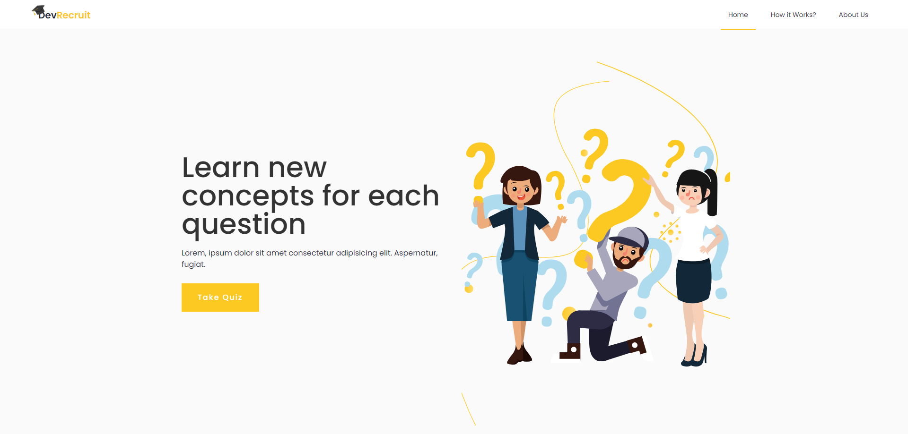

<h1 align="center"> <br/>
 <br/>
DevRecruit Web Appliaction
</h1>

Elevate your coding expertise with devRecruit! This web application offers quizzes in frontend, backend, and full-stack development. Whether you're a seasoned pro or just starting, test and enhance your skills to stay ahead in the dynamic world of software development. Join us on the journey to technical excellence!

## Demo

Here is a working live demo : https://dev-recruit-quiz-app.vercel.app/

<br/>

# Hero Section


<br/>

## Built with

- [React ](https://react.dev/learn) - The library for web and native user interfaces

- [Tailwind](https://tailwindcss.com/docs/installation) - A utility-first CSS framework packed with classes like flex, pt-4, text-center and rotate-90 that can be composed to build any design, directly in your markup..

- [React-Router](https://reactrouter.com/en/main) - React Router is a popular library for handling routing in React applications.

- [Framer-Motion](https://www.framer.com/motion/) - Framer Motion is a production-ready animation library for React that offers declarative syntax, gestures, drag, and path animations. (for page/modal/section transitions)

<br/>

## How To Use

To clone and run this application, you'll need [Git](https://git-scm.com) installed on your computer after that simply follow these commands :

```bash
# Clone this repository
$  git clone https://github.com/MedtheVorg/DevRecruit-Quiz-App.git

# Go into the repository
$ cd DevRecruit

# install dependencies
$ npm install

# Run vite development server
$ npm run dev
```

## Team

| [](https://github.com/MedtheVorg) | [](https://github.com/M-ZAKHBAT) |
| ------------------------------------------------------------------------------------------------------------- | --------------------------------------------------------------------------------------------------- |
| [Mohamed lemaallaoui](https://github.com/MedtheVorg)                                                          | [M-ZAKHBAT](https://github.com/M-ZAKHBAT)                                                           |

## License

MIT

---

> GitHub - [@MedTheVorg](https://github.com/MedTheVorg)

> GitHub - [@M-ZAKHBAT](https://github.com/M-ZAKHBAT)
